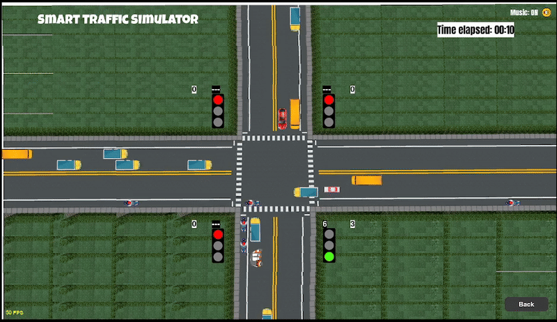

# **🚦Traffic Density-Based Simulator**


## **📌 Summary**<br>
A Python-based traffic intersection simulator comparing fixed-time and adaptive signal control using real-time vehicle density.

## **📝 Description**<br>
<p align="justify">
This project is an interactive traffic simulator designed to evaluate and compare fixed-time and density-based adaptive traffic signal control systems. The simulator models realistic vehicle movement across multiple lanes and directions dynamically generating traffic flow and managing signal phases in real time.
</p>

<p align="justify">
An adaptive control algorithm adjusts green signal durations based on real-time vehicle density that enables more traffic throughput efficiently. Thus, reducing waiting times compared to traditional fixed timer systems. Vehicle counts, signal timings and performance metrics (total vehicles passed intersection and average delay) are continuously tracked and visualized during the simulation
</p>

<p align="center">
  
  <br>
  <em>Traffic Simulator Main Menu</em>
</p>

<p align="justify">
The system is implementated using Python and Pygame framework featuring a graphical user interface, animated vehicles and configurable signal parameters. Simulation results can be exported as Excel format for further analysis making the project suitable for academic studies, traffic engineering research and intelligent transportation system (ITS) experimentation.
</p>

### **🔍 Purpose of Multi-Mode Design**
<p align="justify">
  The simulator provides a direct and fair comparison between fixed-time, rule-based adaptive and vision-based adaptive traffic systems using metrics such as vehicle throughput, waiting time and signal utilization.
</p>

## **🎮 Simulation Modes Overview**

<p align="center">
  
  <br>
  <em>Smart Traffic Simulator running with adaptive signal control</em>
</p>

<p align="justify">
  <strong>🚦 Classic — Fixed-Time Mode</strong><br>
  Classic mode uses a fixed-time traffic signal system where each direction is assigned predefined green, yellow and red durations (eg. 60 seconds). Signal changes follow a cyclic sequence and do not react to traffic demand. This mode represents conventional traffic light systems commonly used in real-world intersections. This serves as a baseline for performance comparison.
</p>

<p align="justify">
  <strong>🧠 Smart — Rule-Based Density Mode</strong><br>
  Smart mode implements a rule-based adaptive signal control system that adjusts green signal durations according to simulated vehicle density on each lane. Vehicle counts are monitored in real time and predefined rules allocate longer green times to lanes with higher congestions. This mode improves efficiency compared to fixed-time control while remaining lightweight and independent of computer vision models.
</p>

<p align="justify">
  <strong>🤖 ATLAS — YOLO-Based Density Mode</strong><br>
  ATLAS mode is an advanced adaptive traffic control system that determines signal timings using YOLO-based vehicle detection. Real-time object detection is used to estimate lane density by identifying and counting vehicles that enables high responsive allocation based on actual traffic conditions. This mode represents an AI-driven smart traffic system bridging Deep Learning and traffic simulation to achieve optimal intersection throughput.
</p>

# **⚙️ Installation & Setup**

## Requirements  
Install the following packages for the simulator app:
- Python 3.8+<br>
👉 Download: https://www.python.org/downloads/
- Pygame<br>
👉 Download: https://www.pygame.org/wiki/GettingStarted
```
python3 -m pip install -U pygame --user
```
- NumPy
- OpenCV (for ATLAS mode)
- Ultralytics YOLO (for ATLAS mode)
- Pytorch (for ATLAS mode)
- CUDA 13.0 or later (for GPU acceleration in ATLAS mode)

### *⚠️ PyTorch Requirement*
👉 Download:
```
pip3 install torch torchvision --index-url https://download.pytorch.org/whl/cu130
```
PyTorch is required **for the ATLAS (YOLO-Based Density) mode**.
Classic and Smart modes do not depend on PyTorch and can run independently.
PyTorch can be installed with **GPU support**. CUDA is optional and needed for faster inference when using an **NVIDIA GPU**.

### *⚠️ CUDA Requirement*
👉 Download: https://developer.nvidia.com/cuda-downloads
<br><br>CUDA is **optional** to run this simulator but recommended.
All simulation modes, including the YOLO-based ATLAS mode, can run on CPU.
CUDA support may be used to accelerate YOLO inference if an NVIDIA GPU is available.

### 🧩 Simulation Mode Dependencies
<div align="center">

<table>
  <tr>
    <th align="center">Simulation Mode</th>
    <th align="center">Pygame</th>
    <th align="center">PyTorch</th>
    <th align="center">YOLO</th>
    <th align="center">CUDA</th>
  </tr>
  <tr>
    <td align="center">Classic</td>
    <td align="center">✅</td>
    <td align="center">❌</td>
    <td align="center">❌</td>
    <td align="center">❌</td>
  </tr>
  <tr>
    <td align="center">Smart</td>
    <td align="center">✅</td>
    <td align="center">❌</td>
    <td align="center">❌</td>
    <td align="center">❌</td>
  </tr>
  <tr>
    <td align="center">ATLAS</td>
    <td align="center">✅</td>
    <td align="center">✅</td>
    <td align="center">✅</td>
    <td align="center">⚠️ Optional (Recommended)</td>
  </tr>
</table>

</div>

## Installation

### 1. 🖥️ Prerequisites
Ensure the following software is installed:
- Python 3.8 or higher
- All other packages installed mentioned in the requirements
- A code editor (any one):
  * Visual Studio Code (recommended)
  * PyCharm
  * Spyder
  * Any Python-compatible IDE

### 2. 📁 Project Folder Setup
* Download or clone the repository:
```
git clone https://github.com/your-username/traffic-density-simulator.git
```
* Make sure the entire folder is kept intact:
```
Traffic_Simulator/
```
*⚠️ Important*  
Do not move or rename files inside the folder. All subfolders (assets, fixed_atlas, smart_atlas, atlas) must remain in the same structure.

### 3. 🧩 Open in Code Editor
- Open your code editor
- Click File → Open Folder
- Select the Traffic_Simulator folder
- Open the integrated terminal inside the editor

### 4. 📦 Install Required Python Libraries
Run the following command in the terminal:
```
pip install numpy pandas opencv-python ultralytics
```

### 5. ▶️ Running the Simulator
From inside the Traffic_Simulator folder terminal, run:
```
python main_menu.py
```
The simulator window will open with a mode selection menu:
- Classic (Fixed-Time)
- Smart (Rule-Based Density)
- ATLAS (YOLO-Based Density)

### 6. 📊 Simulation Results
After each run:
- Statistics are automatically saved as Excel (.xlsx) files
- Results can be found inside each mode’s results/ folder<br>  
Example:
```
fixed_atlas/results/
smart_atlas/results/
atlas/results/
```

## **🗂️ File Structure**
```
Traffic_Simulator/
│
│── main_menu.py                # Main menu and mode selection
│
│── assets/                     # Global assets for main menu
│   │── bg_music.mp3
│   │── sound_hover.mp3
│   │── background_image.jpg
│   │── traffic_icon_green.png
│   │── traffic_icon_red.png
│   │
│   └── fonts/
│       │── Anton-Regular.ttf
│       │── VT323-Regular.ttf
│       │── LuckiestGuy-Regular.ttf
│
│── fixed_atlas/                # Classic (Fixed-Time) simulation mode
│   │── fixed_atlas.py
│   │── settings.py
│   │── controller.py           # Fixed-time signal controller
│   │── vehicle.py              # Vehicle behavior and movement
│   │── traffic_signal.py       # Traffic signal logic
│   │── ui_helper.py            # UI components
│   │── stats_window.py         # Live statistics display
│   │── export_stats.py         # Excel export utilities
│   │── run_summary.py          # Run-level summary generation
│   │── __init__.py
│   │
│   │── assets/
│   │   │── bg_music.mp3
│   │   │── cursor.png
│   │   │── street_background.png
│   │   │
│   │   └── fonts/
│   │       │── Anton-Regular.ttf
│   │       │── LuckiestGuy-Regular.ttf
│   │
│   │── signals/
│   │   │── red.png
│   │   │── yellow.png
│   │   │── green.png
│   │
│   │── vehicles/
│   │   │── up/
│   │   │── down/
│   │   │── left/
│   │   │── right/
│   │
│   └── results/
│       │── fixed_time_stats.xlsx
│       │── fixed_runs_summary.xlsx
│
│── smart_atlas/                # Smart (Rule-Based Density) simulation mode
│   │── smart_atlas.py
│   │── settings.py
│   │── controller.py           # Rule-based adaptive controller
│   │── vehicle.py
│   │── traffic_signal.py
│   │── ui_helper.py
│   │── stats_window.py
│   │── export_stats.py
│   │── run_summary.py
│   │── __init__.py
│   │
│   │── assets/
│   │   │── bg_music.mp3
│   │   │── cursor.png
│   │   │── street_background.png
│   │   │
│   │   └── fonts/
│   │       │── Anton-Regular.ttf
│   │       │── LuckiestGuy-Regular.ttf
│   │
│   │── signals/
│   │   │── red.png
│   │   │── yellow.png
│   │   │── green.png
│   │
│   │── vehicles/
│   │   │── up/
│   │   │── down/
│   │   │── left/
│   │   │── right/
│   │
│   └── results/
│       │── smart_time_stats.xlsx
│       │── smart_runs_summary.xlsx
│
│── atlas/                      # ATLAS (YOLO-Based Density) simulation mode
│   │── atlas.py
│   │── settings.py
│   │── controller.py           # Vision-based adaptive controller
│   │── vehicle.py
│   │── traffic_signal.py
│   │── yolo_integration.py     # YOLO vehicle detection integration
│   │── ui_helper.py
│   │── stats_window.py
│   │── export_stats.py
│   │── run_summary.py
│   │── __init__.py
│   │
│   │── assets/
│   │   │── bg_music.mp3
│   │   │── cursor.png
│   │   │── street_background.png
│   │   │
│   │   └── fonts/
│   │       │── Anton-Regular.ttf
│   │       │── LuckiestGuy-Regular.ttf
│   │
│   │── signals/
│   │   │── red.png
│   │   │── yellow.png
│   │   │── green.png
│   │
│   │── vehicles/
│   │   │── up/
│   │   │── down/
│   │   │── left/
│   │   │── right/
│   │
│   └── results/
│       │── atlas_time_stats.xlsx
│       │── atlas_runs_summary.xlsx
└───
```

## **📄 File Descriptions**

### Root Files
- `main_menu.py`  
  Entry point of the application. Handles mode selection and launches the chosen simulation

### Common Modules (Per Mode)
- `controller.py`  
  Controls traffic signal logic and green time allocation
- `vehicle.py`  
  Handles vehicle movement, speed and lane behavior
- `traffic_signal.py`  
  Manages signal states (red, yellow, green)
- `settings.py`  
  Stores configurable simulation parameters

### ATLAS Simulation Files
- `yolo_integration.py`  
  Integrates YOLO object detection for real-time vehicle counting and density estimation.

### Utilities
- `export_stats.py`  
  Exports simulation statistics to Excel (.xlsx) format
- `stats_window.py`  
  Displays live performance metrics during simulation run
- `run_summary.py`  
  Generates a summary of each simulation run in Excel (.xlsx) format
- `📂 results/`  
  Stores exported simulation outputs in Excel (.xlsx) format for offline analysis and comparison across all simulation modes
- `📂 assets/`  
  Contains all the resources required by the simulator including images, sound effects, background music, fonts and visual elements used in the graphical user interface

# 📖 Citation
If you use this project in academic work, please cite:
> Mahindra Vijay a/l Vijayan, *Adaptive Smart Traffic Light Control System using Deep Learning for Traffic Congestion Management*, 2026
